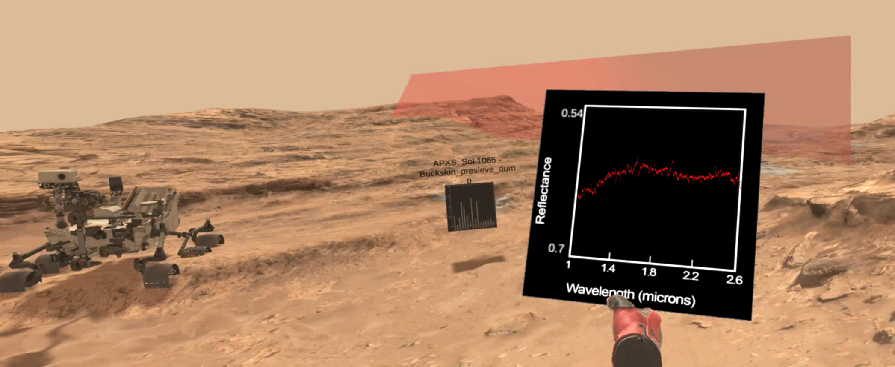

# Planetary-Visor
 

## About
Planetary Visor is our virtual reality tool to visualize orbital and rover-based datasets the ongoing traverse of the NASA Curiosity rover in Gale Crater. Data from orbital spectrometers provide insight about the composition of planetary terrains. Meanwhile, Curiosity rover data provide fine-scaled localized information about Martian geology.

By visualizing the intersection of the orbiting instrument's field of view with the rover-scale topography, and providing interactive navigation controls, Visor constitutes a platform for users to intuitively understand the scale and context of the Martian geologic data under scientific investigation.

A large polyhedron represents a single pixel from the CRISM instrument on the Mars Reconnaissance Orbiter (MRO), a satellite orbiting Mars. The shape of the pixel indicates the angle of incidence of  the MRO when it scanned the ground. In your right hand, a spectral plotter shows the spectral CRISM reading of the pixel. As you drag the pixel around with the right hand trigger button, you can relocate the pixel, dynamically plotting captured spectra of the terrain.

For more information, please refer to our specifications sheet [here](https://docs.google.com/document/d/1kGCzEMR2xrff4Ix_1EuVwuAB_juHsJ6bS9WEtmvN8OQ/edit?usp=sharing).

## Downloads
a. [Quest/Quest2 .apk](https://drive.google.com/drive/u/0/folders/1saZhpeA-oVFzD2kpPOjG9ppVDmhHgpDY)

b. [Mac Desktop app](https://drive.google.com/drive/u/0/folders/17XL8BXiAt1yD2579Hp4jL3Yb1FRPufyY)

c. [Windows Desktop app](https://drive.google.com/drive/u/0/folders/17XL8BXiAt1yD2579Hp4jL3Yb1FRPufyY)
## Contents
This repository contains a Unity project (version 2019.4) with a cross-platform VR scene, as well as a desktop scene. 

To use Planetary Visor in VR, open the “Visor Main XR scene”. To use Visor in desktop mode, open the “Desktop Visor” scene. 
In either one, add the [data file](https://drive.google.com/file/d/1CCanj8WCWzXFJ99qGjfwHSd6wggRgGys/view?usp=sharing) to the Assets/Resources folder.
To add the accompanying [HiRISE mesh](https://drive.google.com/file/d/1cAhYsbwRMsdiet7UFBo99PIZeNEpnXHr/view?usp=sharing), drag it to the Assets/Resources/Images folder.
## Import your own datasets
To visualize your own processed data with Planetary Visor, navigate to Assets/Resources and simply replace the the ddr.bytes file with your own. Additionally, you can add your own reflectance data by swapping out the ssa file for your own.
## Terrain
The Marias Pass terrain in this repository was provided by Google Creative Lab's [Access Mars](https://github.com/googlecreativelab/access-mars).
## Contributors
Connor Richards
Kyle Sese
Hector Taylor
Don Balanzat
Olivia Wang
Jacob Watson
Hannah Bartolomea
Alice Bao
Lauren Gold
